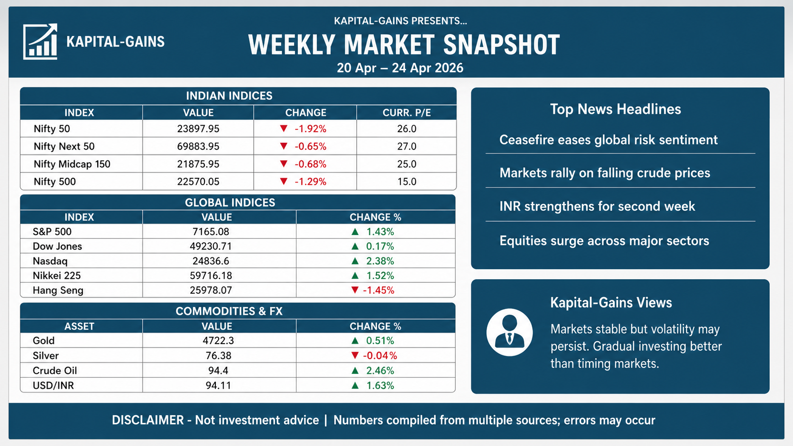
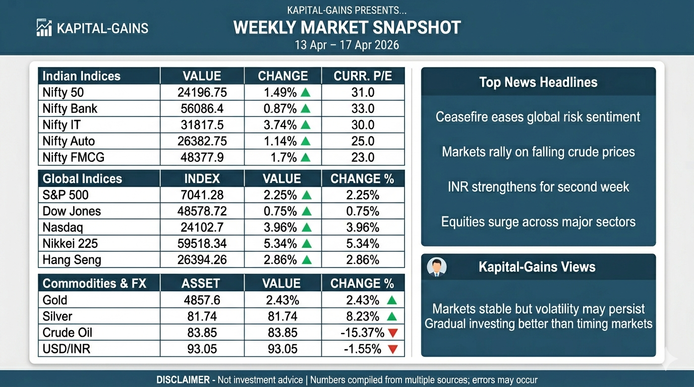

# 📊 Weekly Financial Infographic Generator

[](https://www.python.org/downloads/)
[](https://opensource.org/licenses/MIT)
[](https://github.com/ranaroussi/yfinance)

> Automate weekly market data collection, inject it into a ready‑to‑use prompt, and generate professional infographics using any AI image generator.

---

## 📖 Description

This project collects **real‑world financial data** (Indian indices, global indices, commodities, FX) for the last completed week, enriches it with AI‑generated news headlines and investment insights (via Gemini API), and automatically updates a **markdown prompt** that can be copied into an image generation tool (e.g., ChatGPT, Gemini, or any vision model) to produce a 16:9 infographic.

✅ **No manual data entry** – everything is fetched and injected.  
✅ **Fully customisable** – add your own indices, change colours, layout.  
✅ **Works with free tiers** – no paid subscription required for the data pipeline.

---

## ✨ Features

- **Automated data collection**  
  - Indian indices (Nifty 50, Next 50, Midcap 150, Smallcap 250, Nifty 500)  
  - Global indices (S&P 500, Dow Jones, Nasdaq, Nikkei 225, Hang Seng)  
  - Commodities & FX (Gold, Silver, Crude Oil, USD/INR)

- **AI‑generated insights**  
  - Uses Google Gemini (`gemini-3-flash-preview`) to produce weekly news summaries and Kapital‑Gains views  
  - Output strictly follows JSON schema (3 headlines, 2 insights)

- **Seamless prompt update**  
  - The script directly replaces the `json` code block inside `weekly_infographic_prompt.md`  
  - No intermediate JSON file – the prompt is always ready for image generation

- **Manual override**  
  - You can still edit the JSON block manually before generating the image (e.g., to add your own headlines)

---

## 🧱 Architecture

```
[weekly_data_collector.py]
         │
         ├── Fetches market data (yfinance)
         ├── Calls Gemini API (news + insights)
         └── Writes updated JSON into weekly_infographic_prompt.md
                        │
                        ▼
         [weekly_infographic_prompt.md]
         (contains full layout + latest data)
                        │
                        ▼ (Copy/Paste)
         [AI Image Generator] → final infographic
```

---

## 🔧 Prerequisites

- **Python 3.9+**
- **Google Gemini API key** (free tier works – request quota for `gemini-3-flash-preview`)
- **Active internet connection** (for yfinance and API calls)

---

## 📦 Installation

### 1. **Clone the repository**
   ```bash
   git clone https://github.com/your-username/Weekly-Financial-Infographic-Generator.git
   cd Weekly-Financial-Infographic-Generator
   ```

### 2. **Create and activate a virtual environment**
   ```bash
   python -m venv .venv
   .venv\Scripts\activate        # Windows
   source .venv/bin/activate     # macOS/Linux
   ```

### 3. **Install dependencies**
   ```bash
   pip install -r requirements.txt
   ```

### 4. **Set up your Gemini API key**  
Create a `.env` file (or set environment variable):
```bash
GOOGLE_API_KEY=your_api_key_here
   ```

**OR**
>windows :  set GOOGLE_API_KEY=your_api_key_here
> 
>Mac : export GOOGLE_API_KEY=your_api_key_here 
---
<details>
  <summary>🔑 How to Get a Gemini API Key (Free)</summary>  
  
The script uses the `GOOGLE_API_KEY` environment variable to access the Gemini model. Here's how to get your free API key from **Google AI Studio**, step by step:

### 1. Sign in to Google AI Studio

Go to [Google AI Studio](https://aistudio.google.com) and sign in with your Google account.
If it's your first time, you'll be prompted to accept the Terms of Service for Generative AI before you can proceed.

### 2. Navigate to the API Keys Section

On the left-hand menu, click **API Keys**. This will open your personal API key management dashboard.

### 3. Create a New Project (or select an existing one)

Click the **Create API Key** button. You'll see two options:
*   **Select an existing project** if you already have one.
*   **Create a new project** to start fresh. Give it a clear name (e.g., "Weekly Infographic Generator").

### 4. Generate Your Gemini API Key

Select your project from the dropdown, give your new key a name, and click **Create Key** [6†L46-L48]. The key will be generated instantly.

### 5. Copy and Store Your API Key Securely

A long string of letters, numbers, and symbols will be displayed [6†L49-L52] — copy it immediately.

> ⚠️ **Important Security Note:** Treat this key like a password. Never commit it to version control (like GitHub) or share it publicly. If it's ever exposed, revoke it immediately in Google AI Studio and generate a new one.

### Setting the API Key as an Environment Variable

The best way to set it for this project is by using an environment variable, which keeps the key external to your source code. The script is pre-configured to look for `GEMINI_API_KEY` or `GOOGLE_API_KEY`.

*   **On macOS/Linux:**
    ```bash
    export GOOGLE_API_KEY="your_key_here"
    ```

*   **On Windows (Command Prompt):**
    ```cmd
    setx GOOGLE_API_KEY "your_key_here"
    ```

*   **On Windows (PowerShell):**
    ```powershell
    $env:GOOGLE_API_KEY="your_key_here"
    ```

*   **Using a `.env` file (Recommended)**
    This is the easiest method for this project. Create a `.env` file in the project's root directory and add the following line:
    ```text
    GOOGLE_API_KEY="your_key_here"
    ```
    The `python-dotenv` package (install via `pip install python-dotenv`) can then automatically load the key. Alternatively, you can use the command line methods above.

The free tier is sufficient for this project and does not require a credit card. For more details, you can refer to the official Gemini API Keys documentation.

</details>

---


## ⚙️ Configuration

All settings are at the top of `weekly_data_collector.py`:

| Variable | Purpose | Example |
|----------|---------|---------|
| `MD_FILE_PATH` | Source markdown template | `"weekly_infographic_prompt.md"` |
| `OUTPUT_MD_PATH` | Where the updated prompt is saved | `"weekly_infographic_prompt_updated.md"` |
| `NEWS_PROMPT_PATH` | Prompt file for Gemini news generation | `"news_prompt.md"` |
| `MODEL` | Gemini model to use | `"gemini-3-flash-preview"` |

You can also **add / remove indices** by editing the dictionaries `INDIAN_INDICES`, `GLOBAL_INDICES`, `COMMODITIES` in the script.

---

## 🚀 Usage

### Step 1 – Run the data collector
```bash
python weekly_data_collector.py
```

**What happens automatically:**
- Fetches the last Monday to Friday range.
- Downloads closing prices and calculates weekly changes.
- Calls Gemini to produce 3 headlines + 2 investment views.
- Injects the complete JSON into `weekly_infographic_prompt_updated.md` (or overwrites the original if configured).

**Example console output:**
```
2026-05-02 10:30:00 - INFO - Starting weekly market data collection
2026-05-02 10:30:00 - INFO - Week range: 27 Apr – 01 May 2026
2026-05-02 10:30:05 - INFO - Gemini response parsed successfully
2026-05-02 10:30:05 - INFO - Updated JSON block -> saved to weekly_infographic_prompt_updated.md
✅ PROCESS COMPLETE: Prompt updated with fresh data
```

### Step 2 – (Optional) Manually edit headlines or views
Open the output markdown file and modify the `top_news_headlines` or `kapital_gains_views` arrays if you prefer your own wording.

### Step 3 – Generate the infographic
- Copy the **entire content** of the updated markdown file.
- Paste it into an AI image generator that follows layout instructions (e.g., **ChatGPT (DALL‑E)**, **Google Gemini**, **Midjourney**, or **Banana‑2**).
- The model should output a single 16:9 image – exactly as described in the prompt.

> 💡 **Tip** – The prompt is very strict: “Output ONLY image, no text”. Use a model that supports **image generation** and respects JSON‑based data tables.

---

## 📁 File Structure

```
Weekly-Financial-Infographic-Generator/
│
├── weekly_data_collector.py          # Main orchestration script
├── weekly_infographic_prompt.md      # Prompt template (with placeholder JSON)
├── weekly_infographic_prompt_updated.md  # Output – ready for image generation
├── news_prompt.md                    # Gemini instructions for news & views
├── requirements.txt                  # Python dependencies
├── README.md                         # This file
└── .env                              # (optional) For GOOGLE_API_KEY
```

---

## 📊 Data Sources

| Data Type          | Source                 |
|--------------------|------------------------|
| Indian & Global indices | Yahoo Finance (`yfinance`) |
| Commodities & FX    | Yahoo Finance (`yfinance`) |
| News & Insights     | Google Gemini API (news prompt) |

---

## 🎨 Customisation

### Change the infographic design
Edit `weekly_infographic_prompt.md` – modify colours, fonts, column widths, or text.  
**Do not remove the ` ```json ` block** – the script depends on it.

### Add a new index
1. Add an entry to one of the source dictionaries in `weekly_data_collector.py`:
   ```python
   COMMODITIES["Platinum"] = "PL=F"
   ```
2. Optionally update the markdown table layout to include the new row.

### Switch to a different Gemini model
Change the `MODEL` constant. For free tier, `gemini-2.0-flash` (text only) works for news generation; for image generation you need a model that supports `nano banana` (paid).

---

## ⚠️ Troubleshooting

| Issue | Solution |
|-------|----------|
| `ModuleNotFoundError: No module named 'yfinance'` | Run `pip install -r requirements.txt` inside your virtual environment. |
| `429 RESOURCE_EXHAUSTED` (Gemini API) | You have exceeded your free tier quota for the model. Wait a few minutes or enable billing. |
| No data for Nifty Smallcap 250 | The Yahoo ticker may be invalid. Replace `NIFTYSMLCAP250.NS` with another symbol (e.g., `^NSMLCAP`). |
| JSON block not replaced | Ensure the markdown file contains exactly one code block labelled ` ```json `. The script uses regex `(```json\s*\n)(.*?)(\n```)`. |
| Image generator ignores layout | Use a model that supports **strict layout following**. ChatGPT (DALL‑E 3) with “exact replication” often works best. |

---

## 🚧 Future Enhancements

- ✅ **Direct image generation** – Call an image API (e.g., `imagen-3.0`, DALL‑E) directly from Python, removing the copy/paste step.
- ✅ **Automatic news scraping** – Fetch real headlines from RSS feeds instead of relying on Gemini (reduces API cost).
- ✅ **Dashboard** – Web interface to preview the infographic before generation.
- ✅ **LinkedIn carousel** – Export multiple slides for social media.

---

## 📜 License

Distributed under the MIT License. See `LICENSE` file for more information.

---

## 👨‍💻 Author

**Manoj Mishra**  
[GitHub](https://github.com/your-username) · [LinkedIn](https://linkedin.com/in/your-profile)

---

## 🙏 Acknowledgements

- [yfinance](https://github.com/ranaroussi/yfinance) – Reliable market data
- [Google Gemini API](https://ai.google.dev/) – AI‑powered news generation
- The open‑source community for endless inspiration

---

## 📸 Sample Outputs

| Generated by ChatGPT | Generated by Gemini |
|----------------------|----------------------|
|  |  |

```
